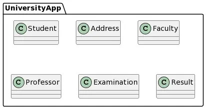
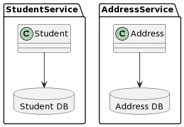

# microservices
A Spring boot microservices project example create on the course [Microservices with Java Spring Boot and Spring Cloud](https://globant.udemy.com/course/microservices-with-java-spring-boot-spring-cloud-eureka-api-gateway/learn/lecture/24730452#overview)

We covered the following topics:
- Comparison between a monolithic project and a microservices project
- WebClient
- Spring Cloud OpenFeign REST Client
- Spring Cloud Netflix Eureka
- Spring Cloud load balancing
- Spring Cloud API Gateway
- Resilience4j
- Sleuth and Zipkin
- Spring Cloud Config Server

## Outcome
With this repository, you can see the evolution from a monolithic app to a microservices architecture. It's a simple project related with a University and we'll convert only two components to a microservices app (Student and Address component):

